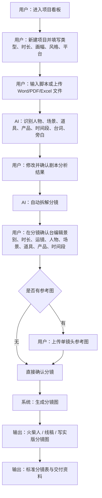

# 核心流程图

## 1. 文本版核心流程

项目看板  
↓  
新建项目  
↓  
填写项目信息  
↓  
导入文字脚本 / 上传文件  
↓  
AI 识别剧本结构  
↓  
人工修改并确认剧本分析  
↓  
自动拆解分镜  
↓  
分镜确认台编辑确认  
↓  
可选上传单镜头参考图  
↓  
生成分镜图（火柴人 / 线稿 / 写实版）  
↓  
导出标准分镜表  
↓  
交付给 AIGC 制作人员

## 2. Mermaid 流程图

## 3. 节点说明

| 流程节点 | 用户操作 | 系统动作 | 输出物 |
|---|---|---|---|
| 项目看板 | 查看项目入口 | 展示示例项目、新建项目、API 设置 | 项目入口 |
| 新建项目 | 填写项目类型、时长、画幅、风格、平台 | 保存项目元信息 | 项目基础信息 |
| 导入脚本 | 粘贴文字或上传文件 | 接收脚本文案 | 原始脚本 |
| 剧本分析 | 修改识别出的实体 | AI 识别结构并允许人工编辑 | 人物、场景、道具、产品等实体池 |
| 分镜拆解 | 点击确认并拆分 | 生成初版镜头 | 初版分镜 |
| 分镜确认 | 编辑字段并确认状态 | 更新镜头结构和确认状态 | 可执行分镜 |
| 上传参考图 | 可选上传单镜头参考图 | 绑定到该镜头 | 参考图记录 |
| 生成分镜图 | 选择火柴人/线稿/写实版 | 生成视觉参考 | 分镜图 |
| 导出交付 | 导出表格和资料 | 生成标准交付文件 | 分镜表、分镜图页 |
